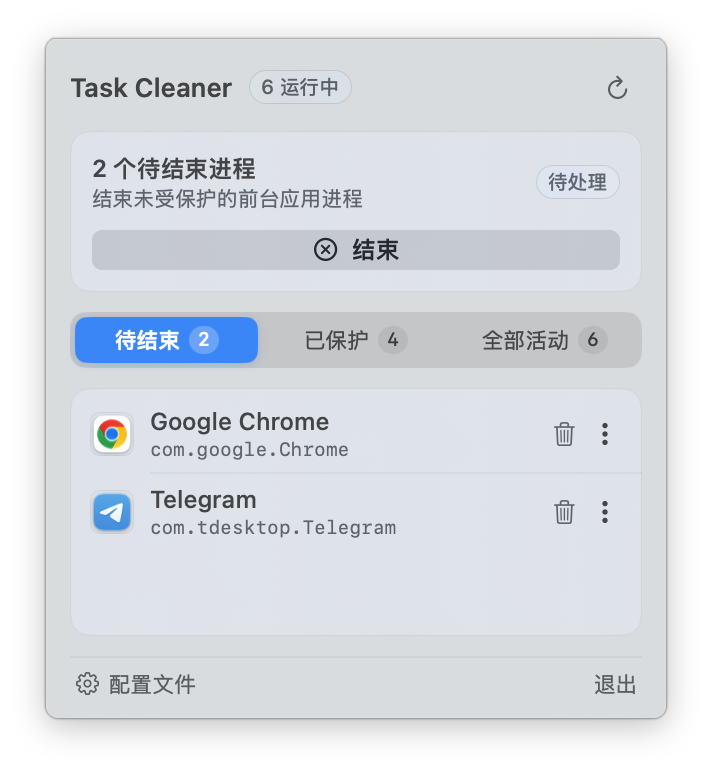

<p align="center">
  
</p>

<h1 align="center">Task Cleaner</h1>

<p align="center">
  <strong>面向 macOS 的轻量、工程级状态栏任务清场与白名单管理客户端</strong>
</p>

<p align="center">
  <a href="README.md">English</a> | <a href="README_ZH.md">简体中文</a>
</p>

<p align="center">
  <a href="https://apple.com/macos"></a>
  
  <a href="https://swift.org/"></a>
  
  <a href="https://www.rust-lang.org/"></a>
  
  <a href="LICENSE"></a>
  <a href="COMMERCIAL.md"></a>
</p>

---

## 界面效果展示

<p align="center">
  
</p>

---

## 下载与快速安装

### 1. 推荐：DMG 拖拽式安装镜像

前往 [GitHub Releases](https://github.com/macos-task-cleaner/macos-task-cleaner-gui/releases/latest) 直接下载适用于您 Mac 架构的安装镜像：

| 硬件架构 | 适用设备 | 安装包直链下载 |
| :--- | :--- | :--- |
| **Apple Silicon** (`arm64`) | Apple M1 / M2 / M3 / M4 芯片 Mac | [TaskCleaner-macOS-arm64.dmg](https://github.com/macos-task-cleaner/macos-task-cleaner-gui/releases/latest/download/TaskCleaner-macOS-arm64.dmg) |
| **AMD64 / Intel** (`x86_64`) | Intel 处理器 / AMD64 架构 Mac | [TaskCleaner-macOS-x86_64.dmg](https://github.com/macos-task-cleaner/macos-task-cleaner-gui/releases/latest/download/TaskCleaner-macOS-x86_64.dmg) |
| **Universal** (`universal`) | 兼容全部 Apple Silicon 及 Intel Mac | [TaskCleaner-macOS-universal.dmg](https://github.com/macos-task-cleaner/macos-task-cleaner-gui/releases/latest/download/TaskCleaner-macOS-universal.dmg) |

双击打开下载的 `.dmg` 文件后，直接将 `Task Cleaner.app` 拖入 `Applications` 文件夹即可完成安装。

### 2. 源码本地编译

要求 macOS 13.0+ 及 Swift 5.9+ / Xcode 环境：

```bash
git clone https://github.com/macos-task-cleaner/macos-task-cleaner-gui.git
cd macos-task-cleaner-gui

# 使用内置脚本一键编译并组装（支持参数: arm64 | x86_64 | universal | all | native）
./scripts/build_app.sh

# 移动至应用程序目录并启动
cp -R build/TaskCleaner.app /Applications/
open /Applications/TaskCleaner.app
```

---

## 核心特性

* **原生菜单栏常驻 (Menu Bar Extra)**：优雅驻留在 macOS 顶部菜单栏，采用纯净白色药丸镂空 X 图标，实时展示未受保护的前台活跃进程计数。
* **现代交互浮窗 (Window Style Popover)**：单键点击菜单栏图标即刻展开半透明浮层面板，支持高精度视网膜应用图标渲染与 Bundle ID 显示。
* **智能自适应高度**：列表高度根据首次打开时的进程数量智能适配（最少容纳 3 个，最多容纳 6 个，超出自动平滑滚动），杜绝界面跳动。
* **独立结束与白名单全功能管理**：
  * **单应用独立结束**：列表项右侧提供小垃圾桶图标，支持精准单独退出特定进程；
  * **竖向拓展菜单 (`⋮`)**：提供一键加入白名单并持久化写入 `~/.config/mtc/config.toml`，支持快速复制 Bundle ID；
  * **已保护应用管理**：切换至“已保护”标签页可直接查看所有白名单应用，并支持随时一键移出白名单。
* **无损分级降级清场**：高亮“结束”按钮触发 `SIGTERM -> 宽限期轮询 -> SIGKILL` 三段式安全退出协议，绕过阻塞式保存确认弹窗。
* **对标系统级实用工具质感**：严格遵循 Apple HIG 规范，应用图标与 Terminal、Activity Monitor 属于同一监视器暗屏家族风格。
* **原生适配 24 种国际主流语言与自动识别**：智能跟随 macOS 系统的首选语言偏好自动匹配，涵盖英语、简体中文、繁体中文、日语、韩语、法语、德语、西班牙语、葡萄牙语、意大利语、俄语、荷兰语、波兰语、土耳其语、阿拉伯语、泰语、越南语、印尼语、瑞典语、丹麦语、挪威语、芬兰语、捷克语、乌克兰语，并在底栏提供即时语言切换菜单。
* **首次开机自启动引导与常驻守护**：首次打开时提供优雅的原生自启动引导卡片，基于 macOS 13+ 原生 `SMAppService` 框架构建，支持在设置菜单随时一键开关开机启动状态。

---

## 项目代码结构

* `Sources/TaskCleanerApp.swift`：应用程序入口与 `MenuBarExtra` 声明、托盘原生矢量绘制
* `Sources/TaskCleanerMenuView.swift`：SwiftUI 交互浮层面板、动态高度协调器、应用行视图与操作菜单
* `Sources/TaskCleanerViewModel.swift`：状态机管理、异步扫描与清场调度
* `Sources/MTCBridge.swift`：与底层 `mtc` 引擎及 TOML 配置的通信桥接层
* `Sources/LaunchAtLoginManager.swift`：原生 `SMAppService` 开机自启动集成与首次引导协调器
* `Sources/I18n.swift`：24 种常用语言国际化注册表与运行时多语言切换器
* `Sources/Models.swift`：数据模型定义与应用图标动态提取
* `scripts/build_app.sh`：自动编译、`TaskCleaner.app` 组装及 DMG 可视化拖拽安装盘生成脚本
* `scripts/generate_app_icon.swift`：应用官方 AppIcon 矢量生成器
* `scripts/generate_dmg_background.swift`：2x Retina 分辨率 DMG 拖拽安装背景图生成器

---

## 关联项目

* **核心算法与进程引擎库 (Rust)**：[macos-task-cleaner-core](https://github.com/macos-task-cleaner/macos-task-cleaner-core)
* **命令行客户端 (Rust)**：[macos-task-cleaner-cli](https://github.com/macos-task-cleaner/macos-task-cleaner-cli)

---

## 许可协议与商业授权

本项目采用双重授权模式（Dual-Licensing Model）：

1. **开源许可证**：遵循 **GNU Affero General Public License v3.0 (AGPLv3)** 协议。个人学习、学术研究与非商业开源项目可免费使用与修改；凡修改或基于本项目构建衍生作品（包括通过网络提供交互服务的 SaaS / 云端调用形态），均须向公众无偿开源全部衍生代码。详见 [LICENSE](LICENSE)。
2. **商业许可协议 (Commercial License)**：面向企业客户、闭源专有产品集成、白标重命名销售或无法遵守 AGPLv3 传染性条款的商业场景，必须事先取得商业授权许可证。详见 [COMMERCIAL.md](COMMERCIAL.md)。
3. **商标与品牌保护**：项目名称、标识图形与应用图标均受版权及商标保护。任何二次分发或分叉 (Fork) 版本必须彻底去除官方品牌元素。详见 [TRADEMARK.md](TRADEMARK.md)。

Copyright (c) 2026 DonJone. 保留所有权利。
